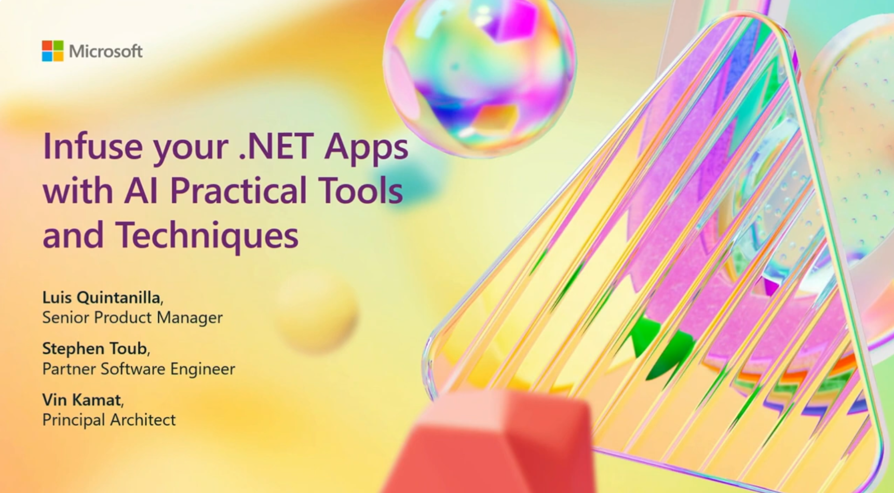

<!-- YAML front-matter schema: https://review.learn.microsoft.com/en-us/help/contribute/samples/process/onboarding?branch=main#supported-metadata-fields-for-readmemd -->

# AI Samples for .NET

Welcome to the official home for .NET samples demonstrating how to use AI in your .NET applications. If you're new to AI, start at the top and work your way down. Otherwise, jump in wherever suits your interests.

### Microsoft.Extensions.AI (preview)

Microsoft.Extensions.AI is a set of core .NET libraries developed in collaboration with the .NET ecosystem, including Semantic Kernel. These libraries provide a unified layer of C# abstractions for interacting with AI services, such as small and large language models (SLMs and LLMs) and embeddings.

Core benefits:

- *Unified API:* Offers a consistent and standard set of APIs and conventions for integrating AI services into .NET applications.
- *Flexibility:* Allows .NET library authors to use AI services without forcing a specific AI provider, making it parameterizable with any provider.
- *Ease of Use:* Enables .NET application developers to experiment with different packages using the same underlying abstractions and to utilize a single API throughout their application.
- *Componentization:* Facilitates the addition of new capabilities and simplifies the componentization and testing of applications.

For more details, see the [Introducing Microsoft.Extensions.AI Preview blog post](https://aka.ms/meai-preview-blog). 

|Topic | GitHub Link |
| --- | --- |
| Abstraction implementations | [GitHub Link](./src/microsoft-extensions-ai/abstraction-implementations/README.md) |
| Azure OpenAI | [GitHub Link](./src/microsoft-extensions-ai/azure-openai/README.md) | 
 OpenAI | [GitHub Link](./src/microsoft-extensions-ai/openai/README.md) |
 Azure AI Inference | [GitHub Link](./src/microsoft-extensions-ai/azure-ai-inference/.md) |
| Ollama | [GitHub Link](./src/microsoft-extensions-ai/ollama/README.md) |

### Microsoft.Extensions.AI.Evaluation (preview)
Microsoft.Extensions.AI.Evaluation is a set of .NET libraries that provide the tooling necessary to evaluate the quality and efficacy of LLM responses in your intelligent applications.

The Microsoft.Extensions.AI.Evaluation libraries are built on top of core AI abstractions defined in the Microsoft.Extensions.AI libraries above. For more details, see the following blog post:
[Evaluate the quality of your AI applications with ease](https://devblogs.microsoft.com/dotnet/evaluate-the-quality-of-your-ai-applications-with-ease/)

| Topic | GitHub Link |
| --- | --- |
| Microsoft.Extensions.AI.Evaluation | [API Usage Examples](./src/microsoft-extensions-ai-evaluation/api/README.md) |

### Build 2024 - Infusing your .NET Apps with AI: Practical Tools and Techniques

Discover how to bring AI into your .NET application! This session covers the tools, libraries, and best practices for incorporating LLMs or other AI capabilities to create an "intelligent app". We'll explore practical examples, including how to leverage Azure AI services and the .NET AI ecosystem, to enhance your apps with AI.

[Youtube: Infusing your .NET Apps with AI: Practical Tools and Techniques](https://www.youtube.com/watch?v=jrNfKeGSuCg)

#### Tutorial: Infusing your .NET Apps with AI: Practical Tools and Techniques

|  #  | Topic                                            | YouTube Link and Time                                          | GitHub Link             |
|-----|--------------------------------------------------|----------------------------------------------------------------|-------------------------|
|  1  | Hello Semantic Kernel                            |  [3m 0s](https://www.youtube.com/watch?v=jrNfKeGSuCg&t=180s)   |  [Hello Semantic Kernel](./src/build-2024/01%20-%20Hello%20Semantic%20Kernel)       |
|  2  | Add Chat History                                 |  [5m 40s](https://www.youtube.com/watch?v=jrNfKeGSuCg&t=340s)  |  [Add Chat History](./src/build-2024/02%20-%20Add%20Chat%20History)       |
|  3  | Add Plugin - Function Call                       |  [7m 10s](https://www.youtube.com/watch?v=jrNfKeGSuCg&t=430s)  |  [Add Plugin - Function Call](./src/build-2024/03%20-%20Add%20Plugin%20%28Function%20Call%29)       |
|  4  | Add Logging                                      |  [9m 24s](https://www.youtube.com/watch?v=jrNfKeGSuCg&t=565s)  |  [Add Logging](./src/build-2024/04%20-%20Add%20Logging)       |
|  5  | Add Plugin - Bing Search                         |  [11m 15s](https://www.youtube.com/watch?v=jrNfKeGSuCg&t=675s) |  [Add Plugin - Bing Search](./src/build-2024/05%20-%20Add%20Plugin%20%28Bing%20Search%29)       |
|  6  | Modify Kernel Behavior with Dependency Injection |  [12m 37s](https://www.youtube.com/watch?v=jrNfKeGSuCg&t=757s) |  [Modifying Kernel Behavior with Dependency Injection](./src/build-2024/06%20-%20Modifying%20Kernel%20Behavior%20with%20Dependency%20Injection)       |
|  7  | Using Semantic Kernel in a Web App                      |  [15m 57s](https://www.youtube.com/watch?v=jrNfKeGSuCg&t=957s) |  [Using Semantic Kernel in a Web App](./src/build-2024/07%20-%20Using%20Semantic%20Kernel%20in%20WebApp)       |

### Quickstarts using OpenAI

|  #  | Topic                                       | GitHub Link                               | 
|-----|---------------------------------------------|-------------------------------------------|  
|  1  | Text Summary                       			    |  [Hike Benefits Summary Project](./src/quickstarts/openai/01-HikeBenefitsSummary/README.md)
|  2  | Hiker AI                                    |  [Hiker AI Project](./src/quickstarts/openai/02-HikerAI/README.md)
|  3  | Chat Context/Data                         	|  [Chatting About my Previous Hikes Project](./src/quickstarts/openai/03-ChattingAboutMyHikes/README.md)
|  4  | Hiker AI Pro (Tool extension)  				      |  [Hiker AI Pro](./src/quickstarts/openai/04-HikerAIPro/README.md)
|  5  | Generating images                    		    |  [Hike Images Project](./src/quickstarts/openai/05-HikeImages/README.md)
| REF |  Using Milvus                               |  [Coming Soon](.)
| REF |  Using Qdrant                               |  [Coming Soon](.)

### Quickstarts using the Azure OpenAI SDK

|  #  | Topic                                       | GitHub Link                               | 
|-----|---------------------------------------------|-------------------------------------------|  
|  1  | Text Summary                       			    |  [Hike Benefits Summary Project](./src/quickstarts/azure-openai/01-HikeBenefitsSummary/README.md)
|  2  | Hiker AI                                    |  [Hiker AI Project](./src/quickstarts/azure-openai/02-HikerAI/README.md)
|  3  | Chat Context/Data                         	|  [Chatting About my Previous Hikes Project](./src/quickstarts/azure-openai/03-ChattingAboutMyHikes/README.md)
|  4  | Hiker AI Pro (Tool extension)  				      |  [Hiker AI Pro](./src/quickstarts/azure-openai/04-HikerAIPro/README.md)
|  5  | Generating images                    		    |  [Hike Images Project](./src/quickstarts/azure-openai/05-HikeImages/README.md)

### Chat samples

|# | Topic | GitHub Link |
|--- | --- | --- | 
| 1 | Customer Support | [Customer Support Project](./src/chat/CustomerSupport/README.md) |    

### LLM Core Concepts

|  #  | Topic                                       | GitHub Link                               | 
|-----|---------------------------------------------|-------------------------------------------|  
| REF | Tokenizer                                   |  [Coming Soon](.)
| REF | Embeddings                                  |  [Coming Soon](.)
| REF | RAG                                         |  [Coming Soon](.)
| REF | Prompts / Prompt Engineering                |  [Coming Soon](.)

### End to End Examples
|  #  | Topic                                       |  GitHub Link |
|-----|---------------------------------------------|--------------|
| E2E | Azure Search .                              |  [Azure Search Repository](https://github.com/Azure-Samples/azure-search-openai-demo-csharp)
| E2E | E-Shop Sample                               |  [E-Shop Repository](https://github.com/dotnet/eshop)

### ML.NET GenAI
|  #  | Topic                                       | GitHub Link |
|-----|---------------------------------------------|-------------|
| REF | Phi                                         |  [Phi](./src/mlnet-gen-ai/Phi)
| REF | LLaMA                                   |  [LLaMA](./src/mlnet-gen-ai/LLaMA)

### Local Embedding Models
| # | Topic                                         | GitHub Link |
|-----|---------------------------------------------|-------------|
| REF | Clip                                        |  [Coming Soon](.)

### Tokenizers
| # | Topic                                         | GitHub Link |
|-----|---------------------------------------------|-------------|
| REF | TikToken                                    |  [Coming Soon](.)

### Vector Databases
| # | Topic                                         | GitHub Link |
|-----|---------------------------------------------|-------------|
| REF | Azure AI Search                             |  [Coming Soon](.)
| REF | PostgreSQL + pgvector                       |  [Coming Soon](.)
| REF | Milvus                                      |  [Coming Soon](.)
| REF | Qdrant                                      |  [Coming Soon](.)

### Reference Examples
| # | Topic                                         | GitHub Link |
|-----|---------------------------------------------|-------------|
| REF | Vector\<T\>                                 |  [Coming Soon](.)

## .NET Foundation

There are many .NET related projects on GitHub.

- [.NET home repo](https://github.com/Microsoft/dotnet) - links to 100s of .NET projects, from Microsoft and the community.
- [ASP.NET Core home](https://docs.microsoft.com/aspnet/core/) - the best place to start learning about ASP.NET Core.

This project has adopted the code of conduct defined by the [Contributor Covenant](http://contributor-covenant.org/) to clarify expected behavior in our community. For more information, see the [.NET Foundation Code of Conduct](http://www.dotnetfoundation.org/code-of-conduct).

## License

.NET (including the csharp-notebooks repo) is licensed under the [MIT](LICENSE) license.
