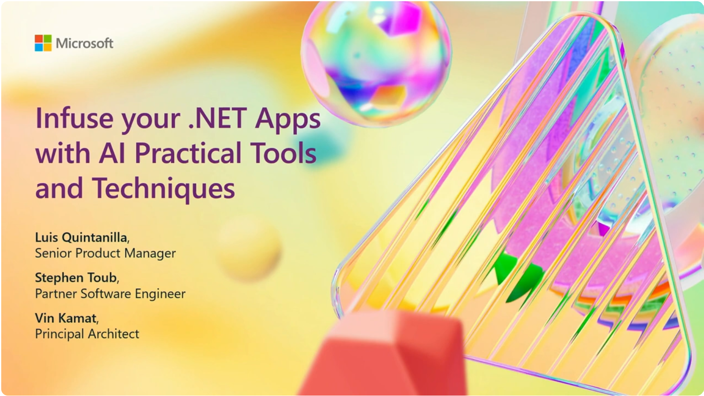

# Infusing your .NET Apps with AI: Practical Tools and Techniques

Learn how to use the Semantic Kernel library in your .NET Applications.

## Prerequisites

- Some C# programming experience
- Basic familiarity with OpenAI Service
- Setup an [Account with OpenAI](https://platform.openai.com/docs/quickstart/account-setup)
- Generate [OpenAI API key](https://platform.openai.com/docs/quickstart/step-2-set-up-your-api-key)
- Generate [Bing API Key](https://learn.microsoft.com/en-us/bing/search-apis/bing-web-search/create-bing-search-service-resource)
- .NET 8.0 SDK - [Install the .NET 8.0 SDK](https://dotnet.microsoft.com/download/dotnet/8.0)

> **ℹ️ Note:** For most common OpenAI API-related issues, such as "You exceeded your current quota" and more, check [here](https://help.openai.com/en/collections/3675943-how-to-fix-common-issues).

1. [Exercise: Hello Semantic Kernel](./docs/Exercise/01%20Hello%20Semantic%20Kernel.md)
   - [YouTube 3m 0s](https://www.youtube.com/watch?v=jrNfKeGSuCg&t=180s)

1. [Exercise: Add Chat History](./docs/Exercise/02%20Add%20Chat%20History.md)
   - [YouTube 5m 40s](https://www.youtube.com/watch?v=jrNfKeGSuCg&t=340s)

1. [Exercise: Add Plugin - Function Call](./docs/Exercise/03%20Add%20Plugin%20(Function%20Call).md)

1. [Exercise: Add Logging](./docs/Exercise/04%20Add%20Logging.md)
   - [YouTube 9m 24s](https://www.youtube.com/watch?v=jrNfKeGSuCg&t=565s) 

1. [Exercise: Add Plugin - Bing Search](./docs/Exercise/05%20Add%20Plugin%20(Bing%20Search).md)
   - [YouTube  11m 15s](https://www.youtube.com/watch?v=jrNfKeGSuCg&t=675s)

1. [Exercise: Modify Kernel Behavior with Dependency Injection](./docs/Exercise/06%20Modifying%20Kernel%20Behavior%20with%20Dependency%20Injection.md)
   - [YouTube  12m 37s](https://www.youtube.com/watch?v=jrNfKeGSuCg&t=757s)

1. [Exercise: Using Semantic with Web App](./docs/Exercise/07%20Using%20Semantic%20Kernel%20in%20WebApp.md)
   - [YouTube  15m 57s](https://www.youtube.com/watch?v=jrNfKeGSuCg&t=957s)

1. [Summary](./docs/Summary.md)

### Build 2024 - Infusing your .NET Apps with AI: Practical Tools and Techniques

Discover how to bring AI into your .NET application! This session covers the tools, libraries, and best practices for incorporating LLMs or other AI capabilities to create an "intelligent app". We'll explore practical examples, including how to leverage Azure AI services and the .NET AI ecosystem, to enhance your apps with AI.

[Youtube: Infusing your .NET Apps with AI: Practical Tools and Techniques](https://www.youtube.com/watch?v=jrNfKeGSuCg)