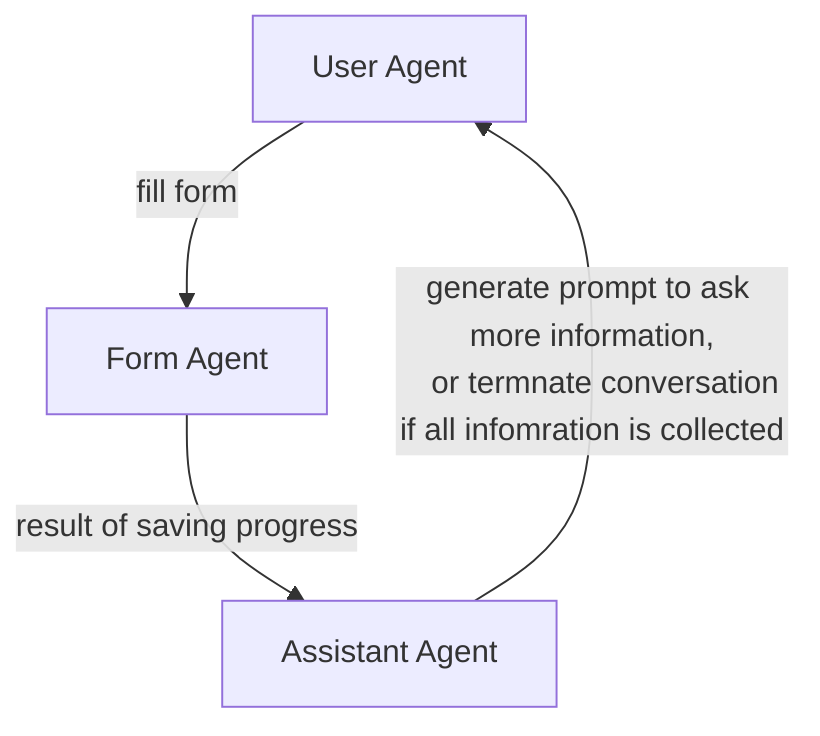

## Form Assistant

This example shows how to build an LLM form assistant to collect information in a polite and conversational manner.

### Prerequisites
- dotnet 8.0 or later
- Access to Azure OpenAI or OpenAI API

### Getting Started
- Clone the repository and cd into this directory
- Run the following command to start the application
```bash
dotnet run
```

The application will start and form assistant will start asking questions to collect information like name, email, phone number, etc. Once all the information is collected, it will display the collected information.

### Output
The output will look like this, where the form agent asks questions and collects information in a polite and conversational manner and user responds to the questions.

> [!NOTE]
> To automate the process, the user in the output below is also an LLM agent powered by gpt-3.5


## Workflow
The following agents are used in this example:
- Form Agent: This agent accepts user input and invoke `SaveProgress` to collect useful information like name, email, phone number, etc. The `SaveProgress` method will return what information is still needed and once all the information is collected, it will return a message to indicate that all the information is collected.
- Assistant Agent: This agent will generate a polite and helpful prompt to ask questions to collect information from the user.
- User Agent: This agent represents the user and responds to the questions asked by the assistant agent.

The multi-agent workflow looks like this:


### Prevent prompt inject attack
The multi-agent workflow designed above is useful to mitigate prompt inject attack because of the following reasons:
- The form agent always invoke `SaveProgress` to collect information and won't respond to any other prompts.
- The assistant agent doesn't generate response based on the direct user input, it generates response based on the result of `SaveProgress` method invoked by the form agent, which makes prompt inject attack difficult.