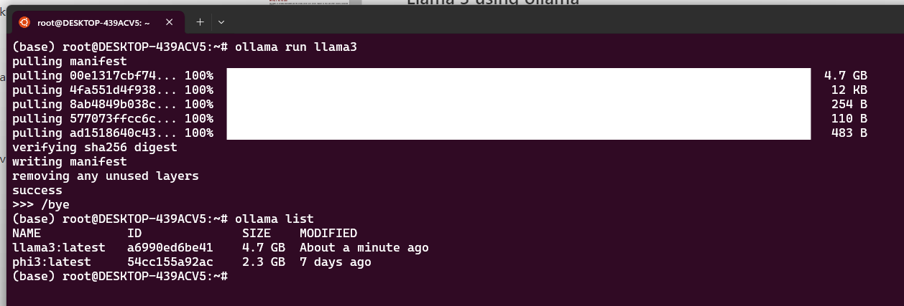

# Phi-3 or Llama 3 using Ollama

This repo contains a sample on how to use a Phi-3 or Llama 3 models with Semantic Kernel.

## Using Local LLMs like Phi-3 or Llama 3 

Local LLMs like Phi-3 and Llama3 represent a significant shift towards more efficient and compact AI models. 

- [**Phi-3**](https://azure.microsoft.com/blog/introducing-phi-3-redefining-whats-possible-with-slms/), developed by Microsoft, uses advanced training techniques like quantization to maximize efficiency, making it ideal for deployment on a wide range of devices.
- [**Llama3**](https://llama.meta.com/llama3/), with its Mixture-of-Experts (MoE) architecture, offers specialized neural networks for different tasks, providing high-quality outputs with a smaller parameter count. 
The use of local LLMs offers several advantages:

- **Reduced Latency**: Local models eliminate network latency associated with cloud-based solutions.
- **Enhanced Privacy**: Data remains on your local device, offering a secure environment for sensitive information.
- **Customization**: Local models allow for greater flexibility to tweak and optimize the models as per your needs.

## Prerequisites

To run Phi-3 or Llama3 model on your local machine, the following prerequisites are required:

- [Install ollama](https://ollama.com/download). Ollama can be installed in macOS, Linux or Windows. 
- Download and run a LLM. 
    [Ollama library](https://ollama.com/library) provides different types of open source models. 
    
    To install Phi-3, run the command:

    ```bash
    ollama run phi3
    ```

    To install Llama 3 run the command:

    ```bash
    ollama run llama3
    ```

- The command `ollama list` will show the local installed models:

    

***Tip**: To see the ollama service journal in realtime, you can run the command:*

```bash
journalctl -u ollama -f
```


## Quick Start

Once the model is running locally, we can now run some prompts using C# and Semantic Kernel.

### Step 1: Run the model

The file `src/local-models/phi3-llama3/Program.cs` shows an example on how to use Semantic Kernel to use the local model. When adding the OpenAI Chat Completion service to the kernel, we must specify the modelId, endpoint and apikey (usually an empty string).

### Chat Completion

#### Phi-3

```csharp
using Microsoft.SemanticKernel;

// Create kernel with a custom http address
var builder = Kernel.CreateBuilder();
builder.AddOpenAIChatCompletion(
    modelId: "phi3",
    endpoint: new Uri("http://localhost:11434"),
    apiKey: "apikey");
var kernel = builder.Build();

var prompt = "Write a joke about kittens.";
var response = await kernel.InvokePromptAsync(prompt);
Console.WriteLine(response.GetValue<string>());
```

### QA Format
```csharp
var prompt = @"Instruction: A skier slides down a frictionless slope of height 40m and length 80m, what's the skier's speed at the bottom?
Output:";
var response = await kernel.InvokePromptAsync(prompt);
Console.WriteLine(response.GetValue<string>());
```

#### Output
```
A classic physics problem!

Given:

* Height of the slope: 40 m
* Length of the slope: 80 m (which is also the distance traveled by the skier)
* Frictionless, so no force opposes the motion (idealized situation)

Let's use conservation of energy to solve this problem. We can calculate the initial potential energy at the top of the slope:

Potential energy = m \* g \* height
= 10 kg \* 9.8 m/s² \* 40 m
≈ 3920 J (joules)

Since the slope is frictionless, all the potential energy will be converted into kinetic energy at the bottom. We can set up an equation:

Kinetic energy = Initial potential energy
m \* v^2 / 2 = 3920 J

where m is the mass of the skier (10 kg in this case) and v is their final speed.

Rearrange to solve for v:

v^2 = (2 \* 3920 J) / 20 kg
≈ 392.8 m²/s²

Take the square root of both sides:

v ≈ √392.8
≈ 22 m/s

So, the skier's speed at the bottom of the frictionless slope is approximately 22 meters per second. To convert this to more familiar units like kilometers per hour or miles per hour, we can do some additional calculations. For example:

22 m/s ≈ 80 km/h (or about 50 mph)
```

### Code Format
```csharp
var codePrompt = @"Complete the following code
```python
def print_prime(n):
    # print all prime numbers less than n";
var response = await kernel.InvokePromptAsync(prompt);
Console.WriteLine(response.GetValue<string>());
```

#### Output
```
Here's how you could do it:

```python
import math

def is_prime(num):
    if num < 2:
        return False
    for i in range(2, int(math.sqrt(num)) + 1):
        if num % i == 0:
            return False
    return True

def print_prime(n):
    for i in range(2, n):
        if is_prime(i):
            print(i)

This code uses a helper function `is_prime` to check whether a number is prime. Then it calls this function for each number from 2 up to n (exclusive), and prints the ones that are prime.

Please note that while this is a correct implementation, it might not be very efficient for large values of n, because it checks divisibility all the way up to `sqrt(n)`. A more efficient algorithm would use a different approach to check divisibility, such as the Sieve of Eratosthenes.
```
